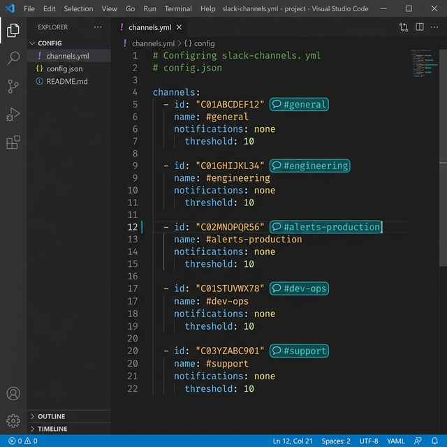
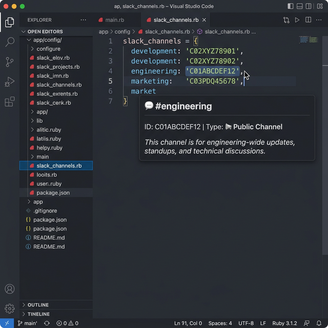

<p align="center">
  
  
  
  
</p>

# Slack Channel Decorator

> **Stop guessing what `C01ABCDEF12` means.** Instantly see the real channel name right in your editor.

**Slack Channel Decorator** is a lightweight VS Code extension that automatically detects Slack Channel IDs in your code and config files, resolves them via the Slack API, and displays the human-readable channel name as an inline decoration — no more context-switching to Slack just to figure out which channel an ID refers to.

---

## Features

### Inline Channel Name Decorations

Slack Channel IDs are automatically detected and annotated with their resolved channel name in a sleek teal badge, directly in your editor.

<p align="center">
  
</p>

### Rich Hover Tooltips

Hover over any Channel ID to see detailed information including channel name, type (public/private), and purpose.

<p align="center">
  
</p>

### Smart Caching

Resolved channels are cached both in-memory and on disk, so repeated lookups are instant and API calls are minimized. The cache persists across editor restarts.

### Secure Token Storage

Your Slack Bot Token is stored using VS Code's built-in **Secret Storage API** — never written to plain text settings files.

---

## Getting Started

### 1. Install the Extension

Install from the [VS Code Marketplace](https://marketplace.visualstudio.com/items?itemName=usuario.slack-channel-decorator), or search for **"Slack Channel Decorator"** in the Extensions panel.

### 2. Create a Slack Bot Token

You'll need a Slack Bot Token (`xoxb-...`) with the following OAuth scope:

| Scope | Description |
|-------|-------------|
| `channels:read` | View basic information about public channels |
| `groups:read` | View basic information about private channels *(optional)* |

> **How to create one:**
> 1. Go to [api.slack.com/apps](https://api.slack.com/apps) and create a new app (or use an existing one).
> 2. Navigate to **OAuth & Permissions**.
> 3. Under **Bot Token Scopes**, add `channels:read` (and `groups:read` if you need private channels).
> 4. Install the app to your workspace.
> 5. Copy the **Bot User OAuth Token** (`xoxb-...`).

### 3. Set the Token in VS Code

Open the Command Palette (`Cmd+Shift+P` / `Ctrl+Shift+P`) and run:

```
Slack Channels: Set Bot Token
```

Paste your token — it will be stored securely and never appear in your settings.

---

## Usage

Once configured, the extension works **automatically**. Open any supported file and Slack Channel IDs matching the pattern `C[A-Z0-9]{8,14}` will be:

- **Decorated inline** with the resolved channel name (e.g., `💬 #general`)
- **Hoverable** to display rich channel information

## Configuration

| Setting | Type | Default | Description |
|---------|------|---------|-------------|
| `slackChannelDecorator.extensionsToScan` | `string[]` | `["yml", "yaml", "rb", "env", "json", "js", "ts"]` | File extensions the extension will scan for Channel IDs |

You can customize the scanned file extensions in your `settings.json`:

```json
{
  "slackChannelDecorator.extensionsToScan": [
    "yml", "yaml", "rb", "env", "json", "js", "ts", "py", "toml", "cfg"
  ]
}
```

---

## Commands

Access all commands via the Command Palette (`Cmd+Shift+P` / `Ctrl+Shift+P`):

| Command | Description |
|---------|-------------|
| `Slack Channels: Set Bot Token` | Securely store your Slack Bot Token |
| `Slack Channels: Clear Cache` | Clear all cached channel data and re-fetch |

---

## Development

### Prerequisites

- [Node.js](https://nodejs.org/) ≥ 18.x
- [VS Code](https://code.visualstudio.com/) ≥ 1.80.0

### Setup

```bash
# Clone the repository
git clone https://github.com/crmendoza093/slack-channel-decorator.git
cd slack-channel-decorator

# Install dependencies
npm install

# Compile TypeScript
npm run compile

# Watch for changes (development)
npm run watch
```
### Packaging

```bash
# Generate the .vsix installer
npx vsce package

# Install locally
code --install-extension slack-channel-decorator-*.vsix --force
```

---

## Contributing

Contributions are welcome! Please feel free to submit a Pull Request.

1. Fork the repository
2. Create your feature branch (`git checkout -b feature/amazing-feature`)
3. Commit your changes (`git commit -m 'Add amazing feature'`)
4. Push to the branch (`git push origin feature/amazing-feature`)
5. Open a Pull Request

---

## License

This project is licensed under the **MIT License** — see the [LICENSE](LICENSE) file for details.

---
